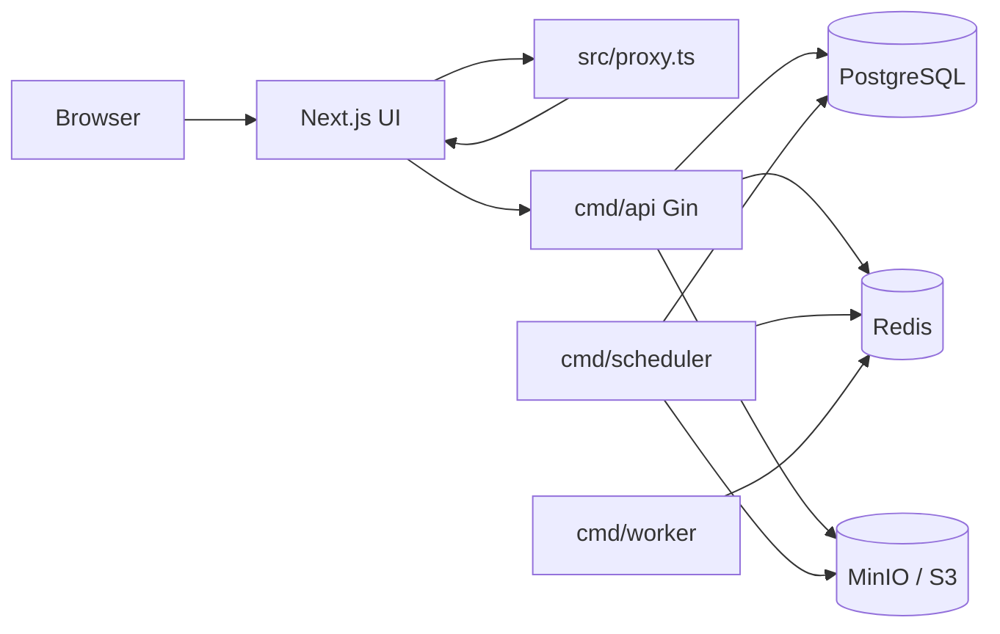

# Kiến trúc thư mục MediaHub

Tài liệu bản đồ monorepo — bổ sung cho [mediahub_production_spec.md](../mediahub_production_spec.md) (đặc tả sản phẩm) và [INSTALL.md](INSTALL.md) (cài đặt).

## Luồng request



- **Next.js** (`frontend/`): dashboard, File Manager, auth UI. Route groups: `app/(auth)`, `app/(app)`.
- **proxy.ts**: kiểm tra cookie / gọi `/api/auth/me` ở biên mạng (Next.js 16). Logic phân quyền chi tiết vẫn ở API và `AuthGuard` client.
- **API**: JWT, media objects, upload multipart, settings, system health.
- **Scheduler**: cron maintenance — không phục vụ HTTP.
- **Worker**: Asynq + FFmpeg — chuyển mã HLS (`video:convert`).

## Cấu trúc monorepo

```txt
MediaHub/
├── backend/           Go services
├── frontend/          Next.js 16
├── deployments/       docker-compose.yml, ví dụ nginx
├── docs/              INSTALL, USAGE, ARCHITECTURE
├── scripts/           wait-postgres, security-smoke
└── Makefile           infra, migrate, api, scheduler, fe
```

## Backend (`backend/`)

### Binary (`cmd/`)

| Binary | Lệnh Make | Vai trò |
|--------|-----------|---------|
| `cmd/api` | `make api` | HTTP API Gin — entry chính |
| `cmd/scheduler` | `make scheduler` | Bảo trì định kỳ: upload expiry, storage deletion jobs, purge trash, temp cleanup, closure repair (`internal/background`) |
| `cmd/worker` | `make worker` | Consumer Asynq — convert video HLS (`internal/worker`) |
| `cmd/migrate` | `make migrate-up` | golang-migrate |
| `cmd/reset` | `make reset-data` | Truncate DB + Redis + xóa object MinIO (giữ volume Docker) |
| `cmd/orphan-cleanup` | `make orphan-cleanup` | Dry-run / apply quét blob không còn DB |

### Layer (`internal/`)

| Thư mục | Trách nhiệm |
|---------|-------------|
| `handler/` | HTTP handlers + `router.go` |
| `service/` | Business logic |
| `repository/` | PostgreSQL queries |
| `storage/` | `ObjectStorage` abstraction (S3/MinIO) |
| `auth/` | JWT, cookies, password, RSA |
| `authz/` | Kiểm tra quyền resource |
| `middleware/` | Auth, CORS, owner, permission |
| `config/` | Env config |
| `background/` | Scheduler jobs (gọi từ `cmd/scheduler`) |
| `worker/` | Asynq task handlers |
| `mediautil/` | Thumbnail, metadata media |
| `reset/` | Logic reset-data |
| `platform/` | Logger + subpackages infra |
| `platform/postgres` | Connection pool |
| `platform/redis` | Redis client |
| `platform/cache` | TTL cache (health metrics) |
| `platform/session` | Token revocation, session invalidation, login rate limit |
| `platform/upload` | Upload rate limit + metrics |
| `observability/` | Host CPU/RAM/disk (system health) |

Quy ước thêm code mới:

- Cùng domain → cùng tên file ở `handler`, `service`, `repository` (vd. `permission.go`).
- Không gọi SDK S3 trực tiếp từ handler — qua `internal/storage`.

## Frontend (`frontend/src/`)

| Thư mục | Trách nhiệm |
|---------|-------------|
| `app/(auth)/` | Login, setup Owner |
| `app/(app)/` | Dashboard, files, members, system, … |
| `components/ui/` | shadcn/ui primitives |
| `components/{feature}/` | UI theo tính năng (files, members, …) |
| `components/layout/` | Shell, sidebar, guards |
| `lib/api/` | API client, env |
| `lib/auth/` | Password crypto, auth UI helpers |
| `lib/upload/` | Chunked upload, limits |
| `lib/schemas/` | Zod schemas |
| `lib/files/` | File manager helpers |
| `lib/utils/` | format, cn, copy chung |
| `lib/navigation/` | Sidebar, breadcrumb labels |
| `lib/permissions/` | Nhãn hiển thị quyền |
| `hooks/` | React hooks dùng chung |
| `proxy.ts` | Next.js 16 network proxy (auth redirect) |

Quy ước: page trong `app/` mỏng; logic UI nặng trong `components/{feature}/`.

## Deploy

- **deployments/docker-compose.yml**: Postgres, MinIO, Redis cho dev.
- **deployments/nginx-upload-rate-limit.example.conf**: ví dụ rate-limit upload qua reverse proxy.
- **deployments/nginx-reverse-proxy.example.conf**: proxy API + `TRUSTED_PROXIES`.
- Observability: `GET /health` (liveness), `GET /metrics` (Prometheus), `GET /api/system/health` và `/api/system/health/{component}` (Owner).

## Tham chiếu

- [mediahub_production_spec.md](../mediahub_production_spec.md) — storage interface, API, security
- [INSTALL.md](INSTALL.md) — chạy local / Docker
- [USAGE.md](USAGE.md) — hành vi người dùng
